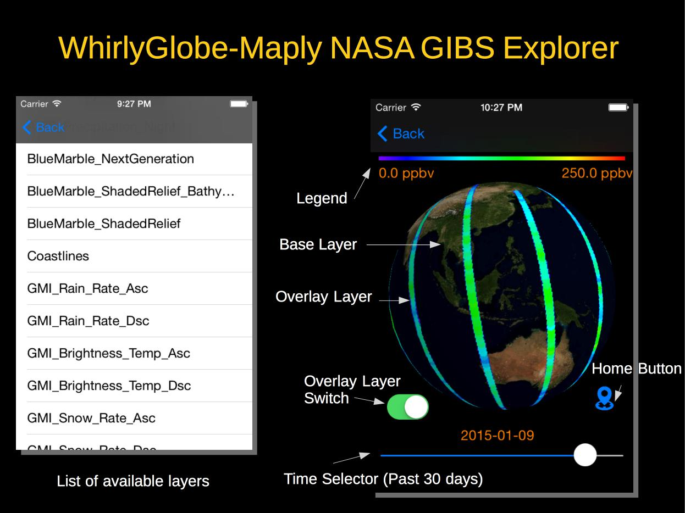

# NASA GIBS Explorer

NASA Global Imagery Browse Service Explorer iOS application based on [WhirlyGlobe-Maply](https://github.com/mousebird/WhirlyGlobe) 

by [M. Sakti Alvissalim](http://alvissalim.wordpress.com).

## About NASA GIBS
NASA Global Imagery Browse Services [(GIBS)](https://earthdata.nasa.gov/gibs) is a service from NASA which provides near real-time imagery from many different satellites. Many different types of imageries are available. 

## Features
NASA GIBS Explorer allows user to browse different type of imageries provided by NASA GIBS without having any knowledge of the API. 

## Requirement

## 

## License

